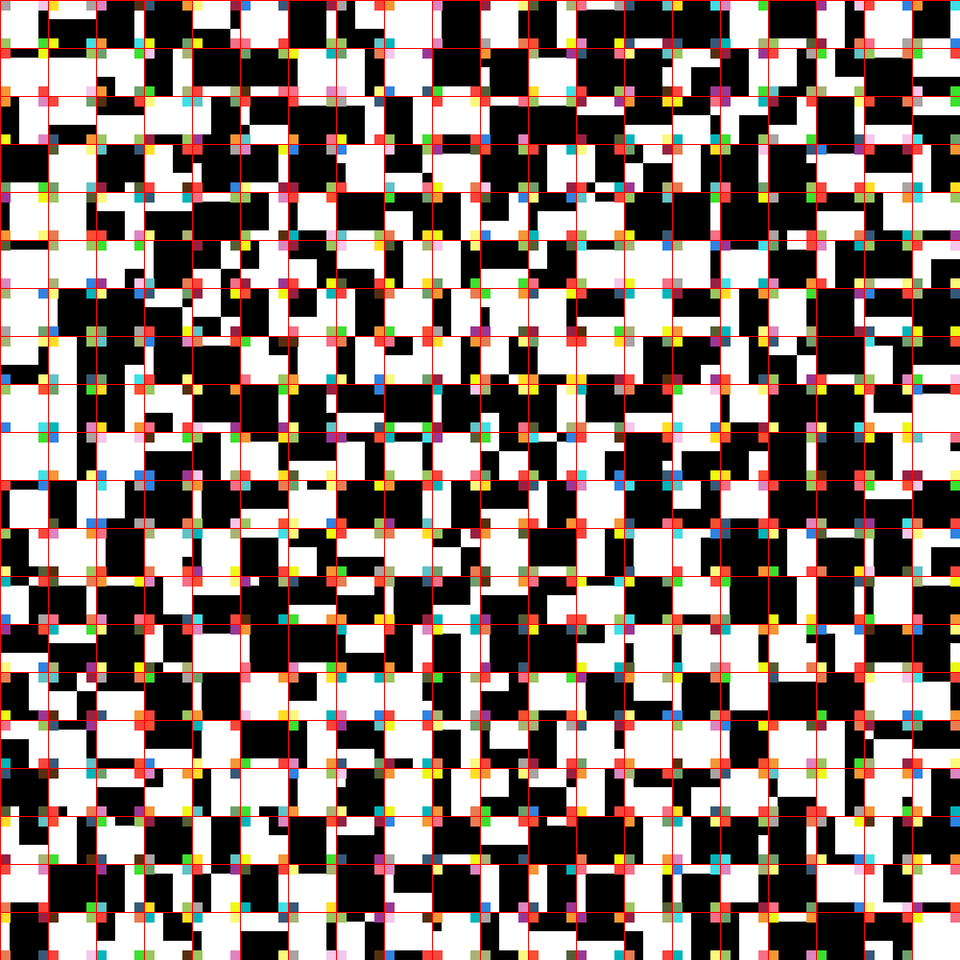
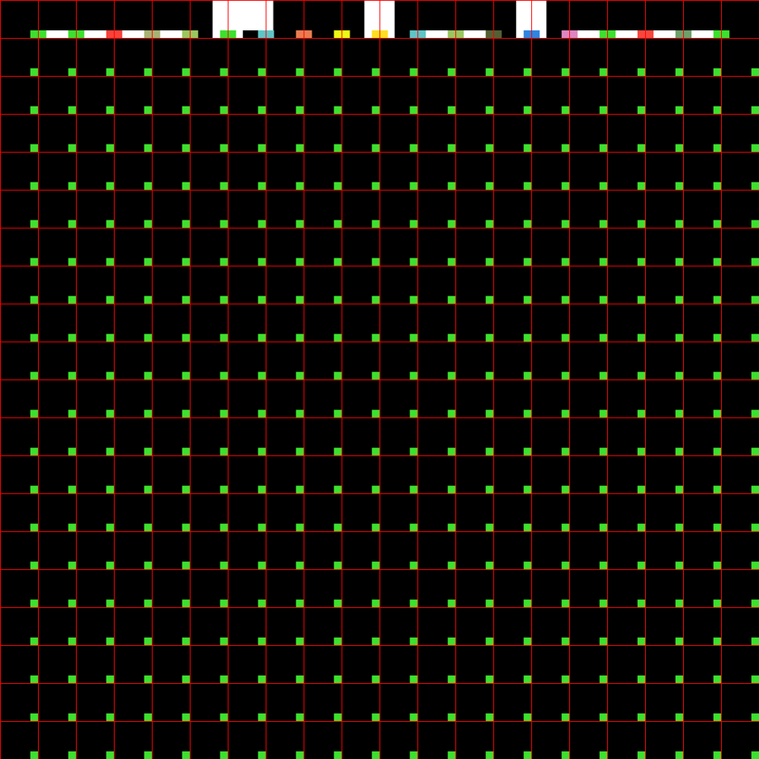
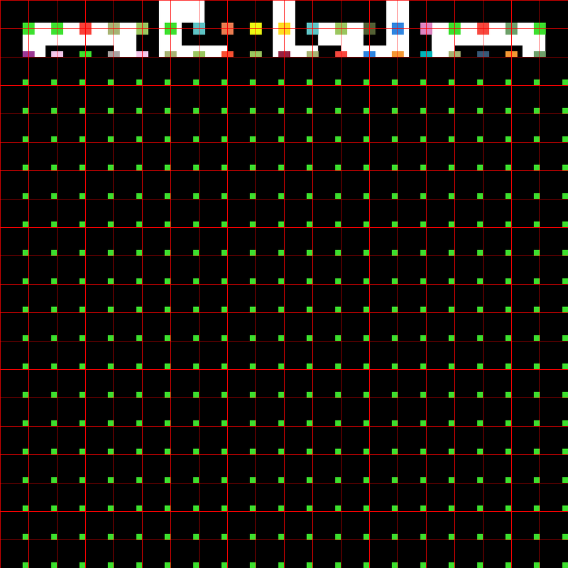
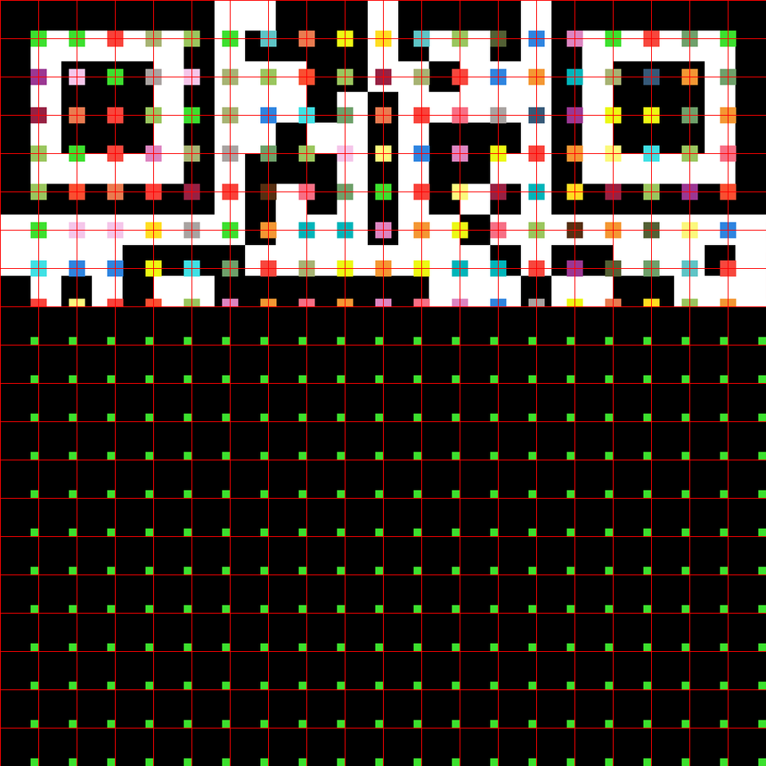
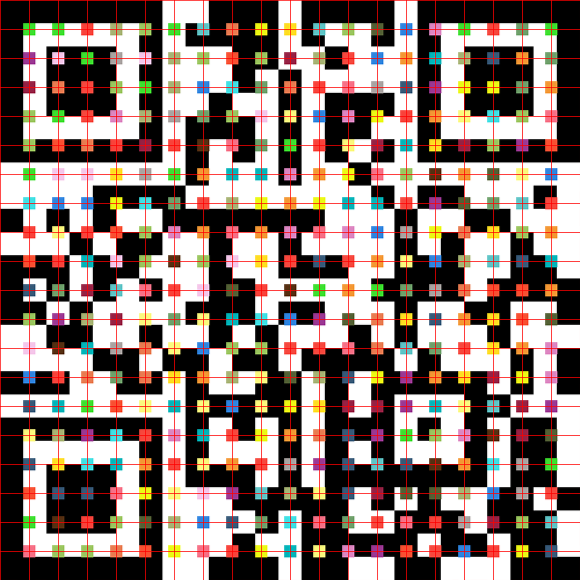
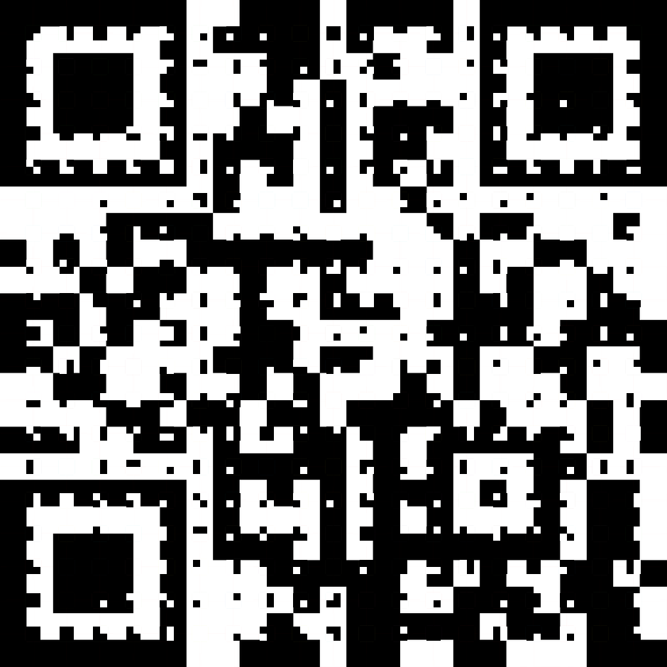
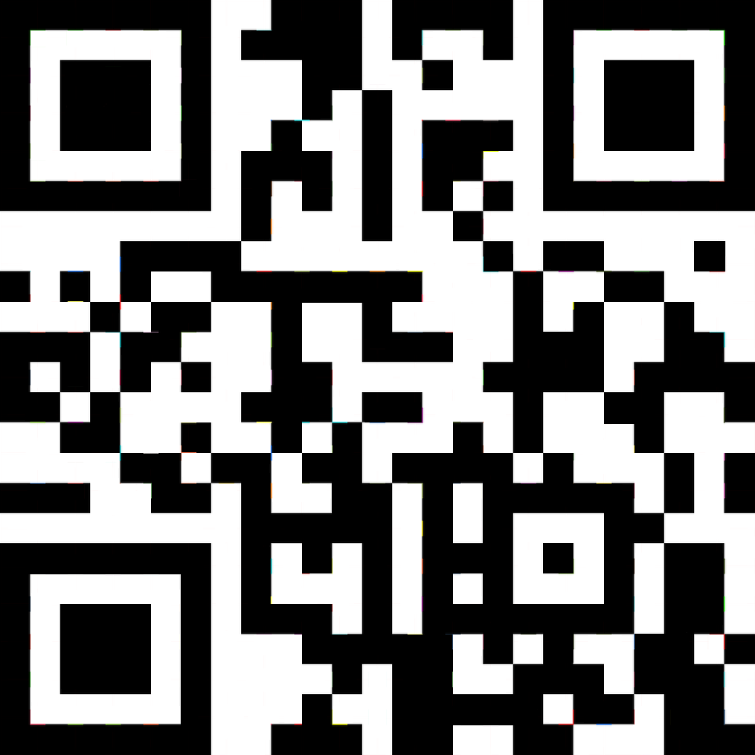

# QR Code Challenge

## Problem

"We found a very strange image and we suspect it is a kind of code, but we couldn't break yet. Are you capable to solve it?"

    

## Solution

To solve this problem I figured out that I could crop the image in small squares and ensemble them like a jigsaw.

After obtaining the small squares the steps were the following:

### Step 1
Obtain the first line, knowing that a QR has 3 main squares. 
Each piece of the puzzle had a color square that matches exactly with at most 2 more

### Step 2
Get the following line to verify the algorithm was working correct

### Step 3
Continue testing the algorithm, while seeing if the QR was appearing on the screen

### Step 4
Complete the jigsaw part of the algorithm. And magically I saw a QR, but I needed to remove those red lines and the color squares.

### Step 5
First of all I removed the red lines and then tried to remove the color squares. Unfortunately the second part broke the QR

### Step 6
Lastly, I tried another approach and a clean QR was ready to scan! 

The QR is not working anymore but, after scanning it, a popup with a message appeared, and that was the code to solve the challenge.

